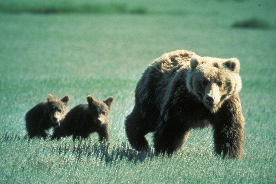
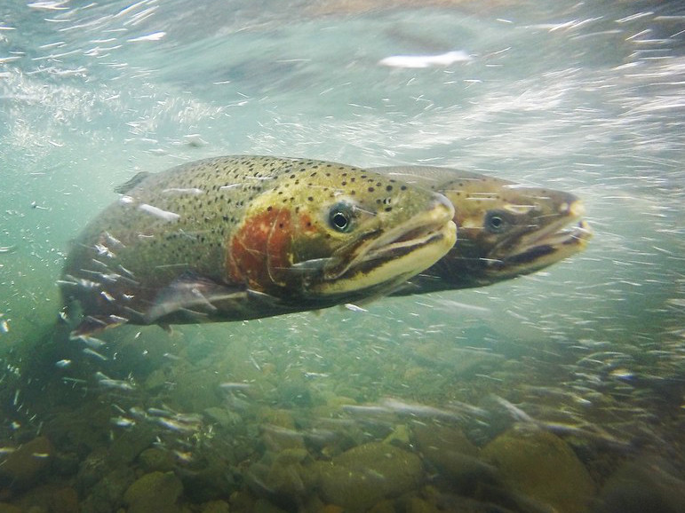

```{r setup, include=FALSE}
# Making sure code doesn't appear on dashboard and loading required packages

knitr::opts_chunk$set(echo = FALSE)
library(flexdashboard)
library(tidyr)
library(dplyr)
library(ggplot2)
library(readr)
library(plotly)
```

# Data Story


```{r include = FALSE}
# Loading datasets I plan to use

url <- 'https://ourworldindata.org/grapher/government-spending-by-function.csv?v=1&csvType=full&useColumnShortNames=true'
budget <- read_csv(url)
url <- 'https://ourworldindata.org/grapher/fish-species-threatened.csv?v=1&csvType=full&useColumnShortNames=true'
fish <- read_csv(url)
url <- 'https://ourworldindata.org/grapher/threatened-endemic-mammal-species.csv?v=1&csvType=full&useColumnShortNames=true'
mammal <- read_csv(url)
```


```{r include=FALSE}
# Filtering excess data from government expenditure dataset

budget_filt <- budget %>%
  select(entity, year, govexp = government_expenditure_by_function__unit_share_gov_exp__function_environmental_protection__function_subcategory_total)

# Preparing mammal dataset for easy alignment to other dataset

mammal <- mammal %>% mutate(year = 2022)

# Joining my three datasets into one

combined <-
  budget_filt %>%
  filter(year %in% c(2022)) %>%
  left_join(fish, by = c("entity", 'year')) %>%
  select(-code) %>%
  left_join(mammal, by=c('entity', 'year')) %>%
  rename(end_fish = en_fsh_thrd_no,
         end_mammal = mammals__threatened_endemics) %>%
  select(entity, year, govexp, end_fish, end_mammal)

# Pivoting my mammal and fish columns into one species type column so I can use both datasets in my visualization

combined_long <- combined %>%
  pivot_longer(
    cols = c(end_mammal, end_fish),
    names_to = "species_type",
    values_to = "endangered"
  )

# Renaming my species types so audience isn't confused by data

combined_long <- combined_long %>%
  mutate(species_type = recode(species_type,
                               end_mammal = "Mammals",
                               end_fish = "Fish"))

# CREATING MY PLOT

plot <-ggplot(combined_long, aes(x = govexp,
                                 y = endangered, 
                                 color = species_type,
                                 text = entity)) +
  geom_point() +
  labs(
    x = "Government Expenditure (%)",
    y = "Number of Endangered Species",
    color = "Species Type",
    title = "Environmental Spending and Endangered Species Across Countries",
    subtitle = "Examining the Link Between Budget Priorities and Endemic Species Threats"
  ) +
  theme_minimal()

```

### **Corresponding Narrative**

{width=48% height=250px} {width=48% height=250px}
  
  In 2015, the United Nations adopted the Sustainable Development Goals (SDGs), which act as a framework to guide the advancement of equity, sustainability, and welfare on earth. Among these goals, SDG 14 (i.e., Life Below Water) and SDG 15 (i.e., Life on Land) establish the necessity of protecting biodiversity throughout the world. The preservation of all endangered species is critical to the security of our vast ecosystems. While these goals are ambitious, ambition alone will not hinder further biodiversity loss. These goals require resources and funding through government initiatives. The following analysis reveals how said government funding is or is not propelled by the loss of biodiversity.
  
  The *adjacent visualization* depicts the relationship between the number of endemic, endangered species (mammals from 2025 & fish from 2022) and the proportions of government expenditures (from 2022) that go toward environmental protection. Some data is potentially flawed, namely for the United States, as the [dataset](https://ourworldindata.org/grapher/government-spending-by-function?tab=table&tableFilter=countries) lists the U.S. having 0% of GDP going toward environmental protection, when in reality it is estimated to exceed 2% [1]. Moreover, additional variables (e.g., GDP, total endemic species, and climate type) would have potentially altered our results. But, when calculating the correlations with the data presented to us, we find that the r-values are approximately equal to zero, telling us that the number of endangered species and government expenditure share little to no linear relationship (no correlation). 
  
  Government spending is reactionary. But as shown by the *visualization*, environmental protection expenditures are not necessarily driven by biodiversity. Some countries like Kenya and South Africa (i.e., not included in datasets) invest their environmental protection fund heavily into biodiversity, but many others focus on areas like pollution abatement or wastewater management based on public concern [2]. Furthermore, the majority of funding contributing to biodiversity oftentimes goes into the conservation of the most widely known populations (e.g., salmon, steelhead trout, and grizzly bears in the United States) [5]. This leaves a great number of threatened species' preservation up in the air. But it also reaffirms just how integral the role of public advocacy is.
  
  Wildlife cannot speak for itself. It needs us. Decision makers won't invest in the conservation of little-known species like the Virginia fringed mountain snail until constituents impress the importance of why their existence matters [5]. Therefore, to promote the success of SDG 14 and SDG 15, communities must rally together and inform their government on the urgency of biodiversity conservation.   

### **The Relationship Between Number of (Endemic) Endangered Species and Proportion of Government Expenditure Contributing Toward Environmental Protection**
```{r}
# MAKING MY PLOT INTERACTIVE

ggplotly(plot, height=850, width=750)

```


# Sources

### **Works Cited (Datasets)**

------------

- **[budget](https://ourworldindata.org/grapher/government-spending-by-function?tab=table&tableFilter=countries)**
  
  OECD (2025) – with minor processing by Our World in Data
  
- **[fish](https://ourworldindata.org/grapher/fish-species-threatened)**
  
  FishBase (Froese and Pauly, 2008), via World Bank (2026) – processed by Our World in Data
  
- **[mammal](https://ourworldindata.org/grapher/threatened-endemic-mammal-species)**
  
  International Union for Conservation of Nature Red List of Threatened Species (2025) – with minor processing by Our World in Data
  
------------ 

### **Works Cited (Textual Sources)**

------------

- [1] **[The Cost of Environmental Protection](https://www.rff.org/publications/journal-articles/the-cost-of-environmental-protection/)**
  
  (Pizer, Morgenstern & Shih 2001)
  
- [2] **[Government Expenditures on Environmental Protection](https://visualizingenergy.org/government-expenditures-on-environmental-protection/)**
  
  (Cleveland 2025)
  
- [3] **[The Trump Administration’s Cancellation of Funding for Environmental Protections Endangers Americans’ Health While Draining Their Wallets](https://www.americanprogress.org/article/the-trump-administrations-cancellation-of-funding-for-environmental-protections-endangers-americans-health-while-draining-their-wallets/)**
  
  (Kelly & Smith 2025)
  
- [4] **[ESA at 50: The Destructive Cost of the ESA](https://www.fws.gov/testimony/esa-50-destructive-cost-esa)**

  (Williams 2023)
  
- [5] **[Most funding for endangered species only benefits a few creatures. Thousands of others are left in limbo](https://apnews.com/article/endangered-species-spending-extinctions-plants-1ad806de0db9d09a38b7e82f6286c1b5)**

  (Brown & Flesher 2023)

------------

